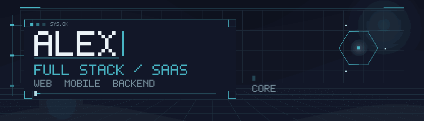

<!--
  GitHub Profile README — Alex (EmulatorAless)
-->

 

🇬🇧 Building end-to-end SaaS products · Web, mobile & backend  
🇪🇸 Construyendo productos SaaS de punta a punta · Web, móvil y backend

---

## 🧭 About me · Sobre mí

<table>
<tr>
<td width="50%" valign="top">

#### 🇬🇧 English

- Full stack developer focused on SaaS products.
- I work across frontend, backend, mobile, APIs, auth and data.
- I care about clear code, solid architecture, and shipping useful software.

</td>
<td width="50%" valign="top">

#### 🇪🇸 Español

- Desarrollador full stack enfocado en productos SaaS.
- Trabajo en frontend, backend, móvil, APIs, auth y datos.
- Me importa el código claro, la arquitectura sólida y entregar software útil.

</td>
</tr>
</table>

---

## 🛠️ Tech stack · Stack tecnológico

<!-- Order for recruiters: Frontend → Backend → Data → Mobile → Tools -->

### 💻 Frontend

  
  
  
  
  
  
  
  
  
  

### ⚙️ Backend & APIs

  
  
  
  

### ☁️ Data · Auth · AI

  
  

### 📱 Mobile

  
  
  

### 🔧 Tools · Herramientas

  
  

---

## 💼 What I do · Qué hago

| 🇬🇧 English                                 | 🇪🇸 Español                                      |
| :----------------------------------------- | :---------------------------------------------- |
| 🚀 Build SaaS-style products end to end    | 🚀 Crear productos tipo SaaS de punta a punta   |
| 🖥️ Design web apps and user experiences    | 🖥️ Diseñar apps web y experiencias de usuario   |
| 📱 Develop mobile apps with Expo           | 📱 Desarrollar apps móviles con Expo            |
| ⚙️ Build backends, APIs, auth & data flows | ⚙️ Crear backends, APIs, auth y flujos de datos |

---

## 💪 Soft skills · Habilidades blandas

| 🇬🇧 English                                                | 🇪🇸 Español                                                       |
| :-------------------------------------------------------- | :--------------------------------------------------------------- |
| Communication · Problem solving · Curiosity · Consistency | Comunicación · Resolución de problemas · Curiosidad · Constancia |

---

## 🌍 Languages · Idiomas

| Language / Idioma | Level / Nivel             |
| :---------------- | :------------------------ |
| 🇪🇸 Español        | Native / Nativo           |
| 🇬🇧 English        | Intermediate · Intermedio |

---

## 🔗 Connect · Contacto

🇬🇧 Links coming soon · 🇪🇸 Enlaces próximamente

**GitHub** · [EmulatorAless](https://github.com/EmulatorAless)

 

✨ Thanks for stopping by · Gracias por pasarte ✨

