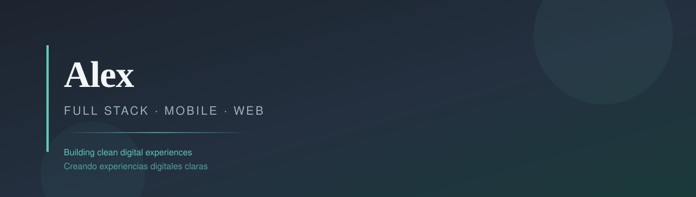

<!--
  GitHub Profile README — Alex (EmulatorAless)
  Custom CSS is stripped by GitHub; visual styles live in assets/*.svg
-->

<div align="center">
  
</div>

<br />

<div align="center">

# 👋 Hi, I'm Alex · Hola, soy Alex

**Full Stack · Mobile · Web Developer**

🇬🇧 I build clean web apps, mobile experiences, and solid backends.  
🇪🇸 Creo apps web claras, experiencias móviles y backends sólidos.

</div>

---

## 🧭 About me · Sobre mí

🇬🇧 · Frontend-focused developer who also works across mobile and backend.  
🇪🇸 · Desarrollador con foco en frontend, también en móvil y backend.

🇬🇧 · I care about readable code, intentional UI, and products people enjoy using.  
🇪🇸 · Me importa el código legible, la UI intencional y productos que se disfruten.

🇬🇧 · Currently shipping personal projects and sharpening my craft every day.  
🇪🇸 · Ahora mismo impulsando proyectos personales y mejorando cada día.

```text
┌──────────────────────────────────────────────────────────────┐
│  👤  Name / Nombre     ·  Alex                               │
│  🎯  Focus / Enfoque   ·  Web · Mobile · Backend             │
│  ✨  Style / Estilo    ·  Minimal, readable, intentional     │
│  🚀  Goal / Meta       ·  Ship useful products people love   │
└──────────────────────────────────────────────────────────────┘
```

---

## 🛠️ Tech stack · Stack tecnológico

Technologies from my projects so far · Tecnologías de mis proyectos hasta ahora:

### 💻 Frontend
<p>
  
  
  
  
  
  
</p>

### 📱 Mobile
<p>
  
  
  
  
</p>

### 🎨 Styling & Motion · Estilos y animación
<p>
  
  
  
</p>

### ⚙️ Backend & APIs
<p>
  
  
  
  
</p>

### ☁️ Data · Auth · AI
<p>
  
  
</p>

### 🔧 Tools · Herramientas
<p>
  
  
  
  
</p>

---

## 📂 Projects · Proyectos

| 🏷️ Project | 🧠 Stack | 📝 About |
| :--- | :--- | :--- |
| **Kivo** (Personal Assistant) | Expo · React Native · NativeWind · Express · Supabase · OpenAI | 🇬🇧 Mobile assistant + async backend<br />🇪🇸 Asistente móvil + backend asíncrono |
| **Kivo Landing** | React · Vite · TypeScript · Tailwind | 🇬🇧 Marketing landing page<br />🇪🇸 Landing de marketing |
| **Landing Page React** | React · Vite · Tailwind · Motion | 🇬🇧 Animated React landing<br />🇪🇸 Landing React con animaciones |
| **Proyecto 1** | React · Vite | 🇬🇧 First React practice project<br />🇪🇸 Primer proyecto de práctica con React |

---

## 🌱 Currently · Ahora mismo

| 📌 Status | 🇬🇧 English | 🇪🇸 Español |
| :--- | :--- | :--- |
| 🚧 In progress | Building my personal portfolio | Construyendo mi portafolio personal |
| 📚 Learning | React patterns & modern CSS | Patrones de React y CSS moderno |
| 🔜 Next | Share more projects in production | Publicar más proyectos en producción |

---

## 🔗 Connect · Contacto

🇬🇧 Links coming soon · 🇪🇸 Enlaces próximamente

<div align="center">

**GitHub** · [EmulatorAless](https://github.com/EmulatorAless)

<br />

✨ Thanks for stopping by · Gracias por pasarte ✨

</div>
