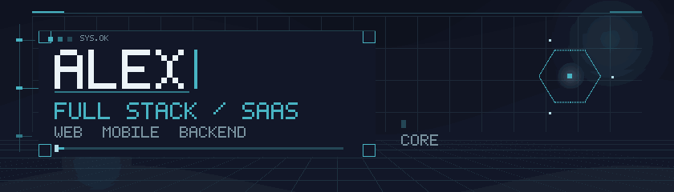

<!--
  GitHub Profile README — Alex (EmulatorAless)
-->

 

🇬🇧 Building end-to-end SaaS products · Web, mobile & backend  
🇪🇸 Construyendo productos SaaS de punta a punta · Web, móvil y backend

 

&nbsp;

&nbsp;

&nbsp;

&nbsp;

---

## 🧭 About me · Sobre mí

<table>
<tr>
<td width="50%" valign="top">

#### 🇬🇧 English

- Full stack developer focused on SaaS products.
- I work across frontend, backend, mobile, APIs, auth and data.
- I care about clear code, solid architecture, and shipping useful software.

</td>
<td width="50%" valign="top">

#### 🇪🇸 Español

- Desarrollador full stack enfocado en productos SaaS.
- Trabajo en frontend, backend, móvil, APIs, auth y datos.
- Me importa el código claro, la arquitectura sólida y entregar software útil.

</td>
</tr>
</table>

---

## 🛠️ Tech stack · Stack tecnológico

<!-- Order for recruiters: Frontend → Mobile → UI & Forms → Backend → Data & Services → Testing → Tools → AI Development -->

### 💻 Frontend

  
  
  
  
  
  
  
  

### 📱 Mobile

  
  
  

### 🎨 UI & Forms · UI y formularios

  
  
  
  
  

### ⚙️ Backend & APIs

  
  
  
  

### 🗄️ Data & Services · Datos y servicios

  
  
  
  

### 🧪 Testing

  
  

### 🔧 Tools · Herramientas

  
  
  

### 🤖 AI Development · Desarrollo con IA

  
  
  
  

---

## 💼 What I do · Qué hago

| 🇬🇧 English | 🇪🇸 Español |
| :----------------------------------------- | :---------------------------------------------- |
| 🚀 Build SaaS-style products end to end | 🚀 Crear productos tipo SaaS de punta a punta |
| 🖥️ Design web apps and user experiences | 🖥️ Diseñar apps web y experiencias de usuario |
| 📱 Develop mobile apps with Expo | 📱 Desarrollar apps móviles con Expo |
| ⚙️ Build backends, APIs, auth & data flows | ⚙️ Crear backends, APIs, auth y flujos de datos |

---

## 💪 Soft skills · Habilidades blandas

| 🇬🇧 English | 🇪🇸 Español |
| :-------------------------------------------------------- | :--------------------------------------------------------------- |
| Communication · Problem solving · Curiosity · Consistency | Comunicación · Resolución de problemas · Curiosidad · Constancia |

---

## 🌍 Languages · Idiomas

| Language / Idioma | Level / Nivel |
| :---------------- | :------------------------ |
| 🇪🇸 Español | Native / Nativo |
| 🇬🇧 English | Intermediate · Intermedio |

---

## 🔗 Connect · Contacto

🇬🇧 Find me online · 🇪🇸 Encuéntrame en línea

&nbsp;

&nbsp;

&nbsp;

&nbsp;

  

✨ Thanks for stopping by · Gracias por pasarte ✨

